---
# Feel free to add content and custom Front Matter to this file.
# To modify the layout, see https://jekyllrb.com/docs/themes/#overriding-theme-defaults

# Github CI
#-----
#Open Source
#Paid Product
#Free Service

title: "Feeder Mods"
layout: single
header:
  overlay_color: "#000"
  overlay_filter: "0.65"
  overlay_image: /assets/img/feature.jpg
  caption: "Photo credit: **Tobias Netzer**"
sidebar:
  nav: "feeders"
---

## Binder clip strip feeder and PCB holder

**Made by**: Curly Tale Games

**Link to source**: [https://www.printables.com/model/150059-lumenpnp-clip-pcb-holder-feeder-strips-and-nozzle-](https://www.printables.com/model/150059-lumenpnp-clip-pcb-holder-feeder-strips-and-nozzle-)

**Description**: The build plate has a lot of screw heads poking up that make it hard to position your strip feeders and PCB holder. These feeders and PCB holder are designed to clip to the edge of the build plate using 0.75” binder clips. It’s easy to position and is extremely secure.

**Photos**: 

## Reel Holder using PVC pipe v3

**Made by**: Curly Tale Games

**Link to source**: [https://www.printables.com/model/343598-smd-reel-holder-for-pick-and-place-machine](https://www.printables.com/model/343598-smd-reel-holder-for-pick-and-place-machine)

**Description**: This reel holder is designed to easily swap out reels of surface mount parts. It's designed to sit on the floor below your part feeders. It's a low cost design which uses two 0.5" PVC pipes and no fasteners. Everything just presses on and the support ribs can be slid to accommodate reels of different sizes.

**Photos**:

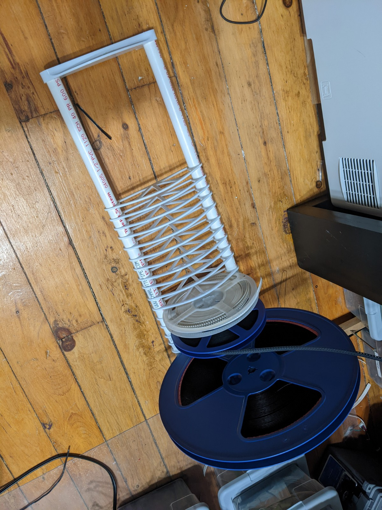

## Reel holder using PVC pipe

**Made by**: Curly Tale Games

**Link to source**: [https://www.printables.com/model/206646-lumen-reel-holder-pvc-pipe](https://www.printables.com/model/206646-lumen-reel-holder-pvc-pipe)

Description: I designed a shelf that holds 6” and 7” reels of parts. It clips onto the aluminum extrusion and is designed to hang off the side of a table. It’s designed to use 1/2” PVC pipe cut to 56cm in length. The mount and shelf are printed as two pieces and connected using M3 screws, you can use anything from 6mm to 15mm long screws.

**Photos**: 

## Reel holder using PVC pipe v2

**Made by**: Curly Tale Games

**Link to source**: [https://www.printables.com/model/219080-lumen-reel-holder-pvc-pipe-v2](https://www.printables.com/model/219080-lumen-reel-holder-pvc-pipe-v2)

**Description**: This version uses new front feet that mount the aluminum extrusion flush with the edge of the Lumen. It increases the build area, fixes the nozzle clearance issues for feeders, and makes it easy to remove the entire feeder rail. For easy removal tap the ends of the 2020 extrusion with an M5 tap. The shelf holds 4”,  6”, and 7” reels of parts. It clips onto the aluminum extrusion and is designed to hang off the side of a table. It’s designed to use 1/2” PVC pipe cut to 56cm in length. The mount and shelf are printed as two pieces and connected using M3 screws, you can use anything from 6mm to 15mm long screws.

**Photos**:.stl

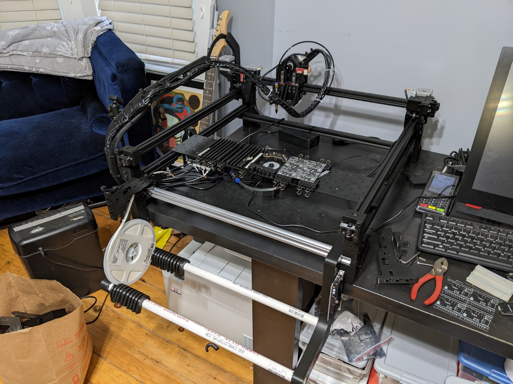

## Slim Reel Hanger

**Made by**: qwertymodo

**Link to source**: [https://www.printables.com/model/230805-lumen-pnp-slim-reel-hanger](https://www.printables.com/model/230805-lumen-pnp-slim-reel-hanger)

**Description**: This is a slimmed-down and reinforced version of Stephen’s original passive single-reel hanger, and is only 16mm wide.  To use with the parametric strip feeder model in the opulo repo (FDM-9002), change the HolderW parameter to 8.0, and you will be able to run these hangers side-by-side for multiple reels.

**Photos**:

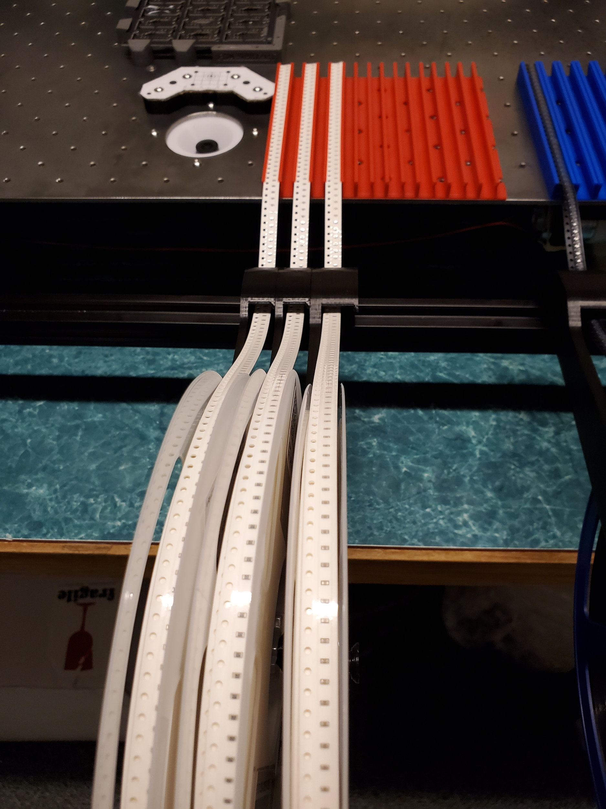

## Passive Drag Feeder

**Made by**: jazzychad

**Link to source**: [https://www.printables.com/model/221378-lumen-pnp-passive-drag-feeder](https://www.printables.com/model/221378-lumen-pnp-passive-drag-feeder)

**Description**: Passive drag feeder model for Lumen PnP which uses gears to pull back cover tape from advancing component strip.

**Photos**:

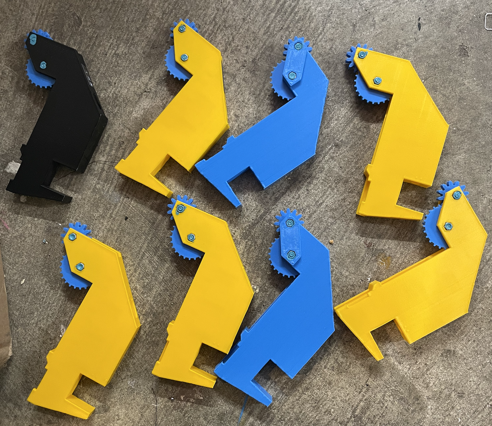

## Passive Drag Feeder for V3

**Made by**: stargirl

**Link to source**: [https://www.printables.com/model/338597-lumenpnp-v3-passive-drag-feeder](https://www.printables.com/model/338597-lumenpnp-v3-passive-drag-feeder)

**Description**: Jazzychad’s passive drag feeder modified to work with LumenPnP V3

**Photos**:

## Passive 8mm Feeder

**Made by**: Stephen Hawes

**Link to source**: [https://www.printables.com/model/365107-passive-8mm-feeder-for-lumenpnp-v2](https://www.printables.com/model/365107-passive-8mm-feeder-for-lumenpnp-v2)

**Description**: Passive tape feeder for 8mm tape

[Video Here](https://www.youtube.com/watch?v=Gm1oQjoRitc)

**Photos**:

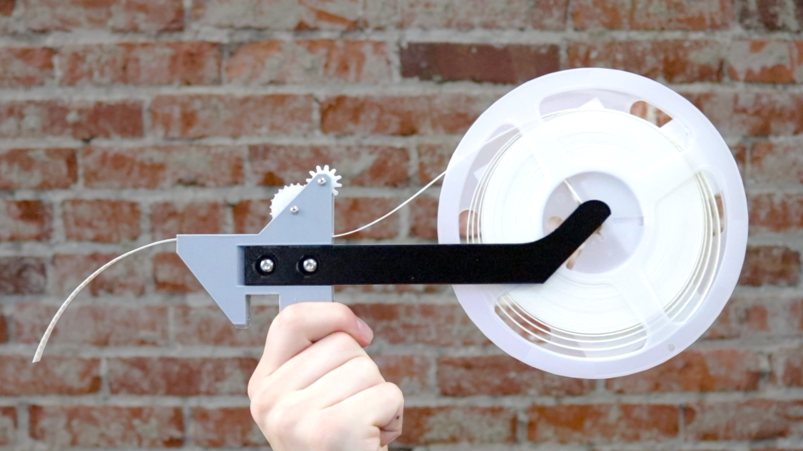

## Cut Tape Holder for LumenPNP

**Made by:** Grant W

**Printables Link:** [https://www.printables.com/model/227482-lumenpnp-smt-cut-tape-holder](https://www.printables.com/model/227482-lumenpnp-smt-cut-tape-holder)

This is an SMT cut tape holder specifically designed for the LumenPNP.

The provided STL is for an 8mm SMT strip. There is also a *.step file that can be extruded wider to accommodate wider tape.

There is an optional slit in the top of the holder to remove and route clear cover tape from strip.

The width of the 8mm holder matches up with the strip holder provided by a discord community member (See link below).

Link to strip feeder (Courtesy of ***curlytalegames***): [https://www.printables.com/model/150059-lumenpnp-clip-pcb-holder-feeder-strips-and-nozzle-](https://www.printables.com/model/150059-lumenpnp-clip-pcb-holder-feeder-strips-and-nozzle-)

**RECOMMENDED PRINT SETTINGS:**

3 Perimeters, 4 Bottom Shells, No Support

**Photos:**

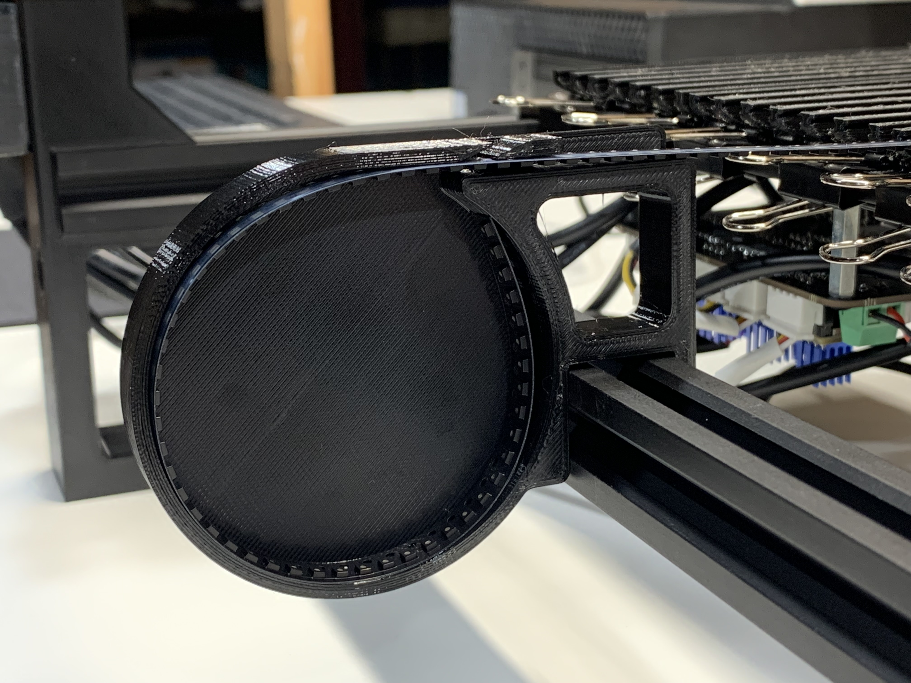

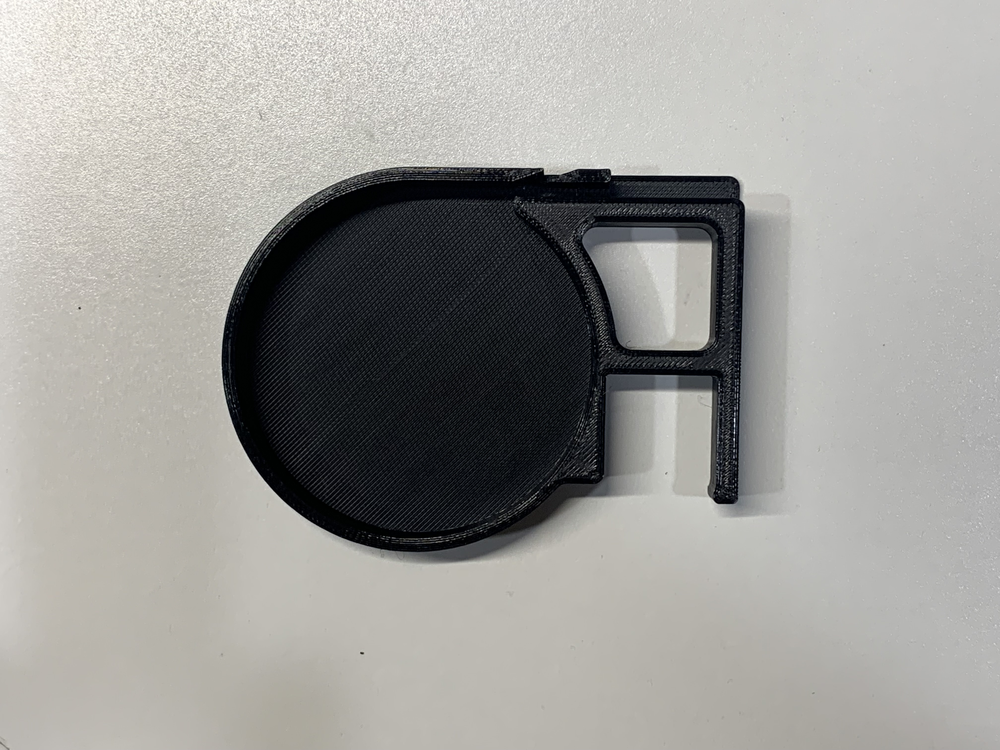

## 0816 Feeders modified for the Lumen

**Submitted by**: infiniteneslives

**Original 0816 Feeder Design:** [https://docs.mgrl.de/maschine:pickandplace:feeder:0816feeder](https://docs.mgrl.de/maschine:pickandplace:feeder:0816feeder) 

**Nicmoly’s 0816 remix for lumen:** [https://docs.mgrl.de/maschine:pickandplace:feeder:0816feeder](https://docs.mgrl.de/maschine:pickandplace:feeder:0816feeder)

**Vertical tape peeler mod:** [https://github.com/SebG3D/TapePuller](https://github.com/SebG3D/TapePuller)

**My unholy mess of hacking all of the above together with some modifications:** [https://www.tinkercad.com/things/8lZPBSnpAl1](https://www.tinkercad.com/things/8lZPBSnpAl1)

**My struggle/walkthrough on configuring openPNP to use 0816 feeders:** 
[https://discord.com/channels/688723670461448225/950431562443399178/967905022547488808](https://discord.com/channels/688723670461448225/950431562443399178/967905022547488808)

For starters this post is meant to provide one place to point to where people can find the 0816 feeder infomation that I’ve learned.  I have my own remix that used nicmoly’s remix as a starting point.  My efforts are very much a work in progress and just trying to get to something working to the point where I can use it and learn how might be worth improving.  I started hacking away because I needed 12mm, 16mm, & 24mm variants, but with each one I build I’ve came up with some improvements.  

Below is my latest revision of the 8mm feeder, I found recently that I’ve got some issues with the vertical peeler though.  The film has a tendency to push off to one side & eventually clog.  Planning to make a little insert to correct this problem on my existing feeders, and then integrate into the body of the feeder if it works.

So I don’t really recommend printing this version, but I’m tired of saying I’ll share it eventually...  

[816-lumen-remix 8mm-g_all public.3mf](assets/img/mods/816-lumen-remix_8mm-g_all_public.3mf)

Consider all the other projects & documentation as required prior reading, and source of truth.  I might put together some assembly docs/video in the future as they’re a bit challenging to assemble.  But for now I just wanted to put my Aliexpress shopping list up as I’ve used them long enough now to make some semi-decent recommendations.  The original project includes a BOM which should cover everything, but translating those specs to a shopping cart can be tricky, and some things can be paired down or simplified.

**Control Board:**  Number of better solutions out there, but I just started with easiest to get my hands on, arduino mega with a perf board hat.  There’s a native shield in the original design but it includes some unneeded features like vacuum sensing, alternatively you can use an arduino sensor sheild but the feedback signals aren’t routed as needed.  Curly Tale Games is working on a more proper arduino mega hat, Nicmoly included a build adapted for arduino nano, and Atanisoft is working on an ESP32 based control board.  All of those are better options, but this was quickest path for me to get started with a handful of feeders.

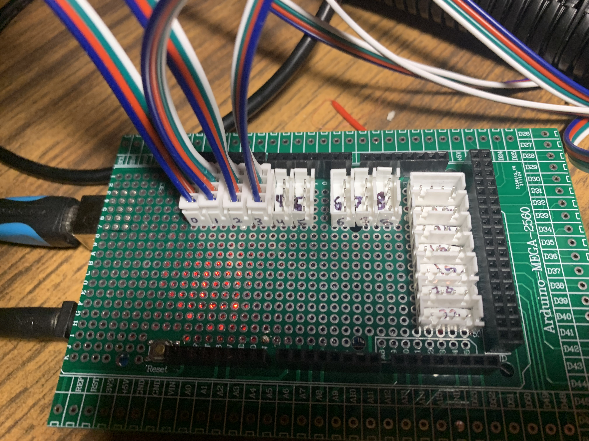

**Power:**  You will need a source of 5v power for the feeders while you can power them from USB, I wouldn’t recommend it.  I have used USB power for quick testing of a single feeder, but you can easily draw more than few hundred milliamps.  The servos are quite weak and likely to have difficulty advancing the tape with USB power.  I’m currently using 5V 2.5A barrel connector Arduino power supply I had sitting around.  Picked up some 24v → 5v step down converters so I can power the feeders from same power supply as the lumen.

**Wiring & feeder PCB:**  Come up with a plan to connect everything.  Currently I’m just hard wiring everything in the feeder, not bothering with a feeder PCB since it’s mostly just connectors.  Original project has a small feeder PCB you can use if desired.

**Feeder hardware:**  Here all the parts I use in my 0816 feeders, break down of where I bought them follows.

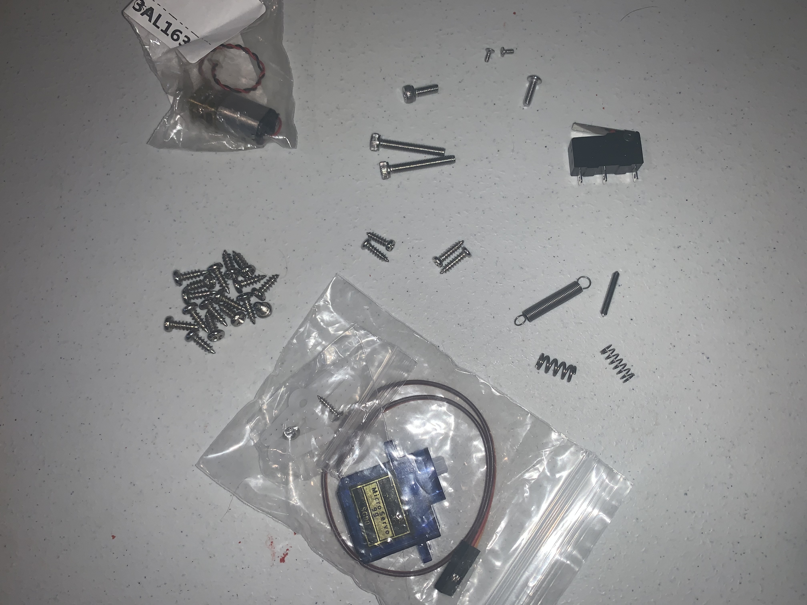

**9 gram servo:**  This is the main servo that advances the tape, these are the ones I’ve used.  The SG90 is cheaper and has plastic gears, the MG90 is a little more and has metal gears.  I recommend shopping for high quality servos from hobbyking or the likes, but cheapos are working well for me so far.  Ideally they’ll be 12mm wide and fit better inside the feeder, but all the ones I order end up being 12.4mm wide at the base regardless of advertised with.  So I modified my feeder remix to support.  The servos usually come with the arm you need as well as some screws to connect the arm to the feeder advancing poker.

**N20 motor:** This is the motor used to peel the film from the tape.  Needs to operate ~5v, the RPM isn’t all that important.  I’ve found that 60RPM motors are easiest to find and so they usually cost less.  All the ones I’ve tried have worked so far.  Higher RPM motors would probably work fine, but there’s not much benefit, arguably the lower RPM motors with higher torque will be best.

**Limit switch:** This controls the N20 motor & provides a feedback signal to the feeder controller.  See the original 0816 project for size specs.  These are larger than the limit switches used on the lumen PNP machine.

**2mm stainless rod/pin:** Each feeder uses 12-14mm, I clip them with a big diagonal cutter and then file the edges round with the help of a drill.  A single 400mm length should build 25+ feeders.  It’s possible that you could modify the FDM design to utilize 1.7mm 3D printer filament instead, but I’ve never tried.

**Strong compression spring:** This spring is used to on the tape friction arm to keep the tape in place when not being advanced forward.  This spring needs to be relatively stiff.  Might even be possible to get a feeder working (perhaps testing purposes) without this spring and use force from a bolt alone.  Or perhaps a 3D printed bushing shape printed from flexible filament could work here.  

As for metal springs, 5mm OD is best as the ID is perfect for the M3 screw without a washer.  The spring should be ~10mm long, I have had luck with 15mm long springs but extra length just complicates things.  With those dimensions, I’ve found that 0.8mm thick spring wire works well.  I usually tighten them ~3 turns once the tape is inserted and then adjust as necessary from there.

**Weak compression spring:** This spring is used to mate the peeler gears together with some compliance.  Not much pressure is needed here to get the gears to bite the film, this is especially true for the helical gears in the vertical peeler.  You might be able to 3D print a weak plastic spring from PETG perhaps.  Or you might find a spring that works here inside a clicky pen.

As for metal springs, this is going on an M3 bolt as well, being a smaller wire 4mm OD works well.  You can likely compress any weak spring far enough to make the min length in use of ~5-8mm.  I find 10mm length & 0.4mm wire works well.

**Expansion spring:**  This spring applies force to the peeling lever to remove the film from the tape.  The best spring may depend a bit on the tape used, although the 0816 feeder design includes 4 different mounting holes for this spring to make the force applied here more easily adjustable.  Some people have had luck using rubber bands here, but I haven’t tried.  I’ve found this is one of the more tricky springs to get exactly right for all use cases so probably good to get an assortment if you can.

If the spring is too strong it might pull the film from the peeler gears, or require too much torque from the N20 motor.  If the spring is too weak, it won’t provide the force needed to remove the film from the tape quickly enough.  I’ve found that the wider tapes 12mm+ usually need more force than 8mm tapes, and paper tapes need more force than plastic ones.

The mounting holes span a gap of 25-45mm when the peeling lever is relaxed.  So a relaxed spring should be ~25mm total length or less (including mounting loops) to provide the most options for adjustable tension.

I’ve found that 4-6mm OD springs are a nice size that also mount well with the M3 bolts.

With those dimensions in mind you probably want the spring wire to be 0.4-0.6mm thick.  I’m currently using the 0.4mm spring wire below, and it’s working although it’s usually too weak on the shortest mount holes.   I think the 0.5mm wire x 5mm OD x 25mm long might be ideal with a good range of desired tension between mounting holes.

**2x M1.6 - 4mm counter sunk screws:** Used for mounting the N20 motor, these are mostly non-negotiable.  The N20 motor mount is M1.6 threads, too long and the screw will get into the gears, bigger head and it’ll get in the way of the worm gear on the peeler mechanism.  They’re tiny, buy extras from when you drop em on the floor.. ;)

**4x Servo & limit switch mounting screws:**  I’m currently using 4 of the same M2.6 x 10mm wood screws here because I had em already and they’re a nice size.  I think the original used M2.5 machine screws here.  I like how the wood screws are easier to install, although they are slightly big & long for the limit switch mount.  8mm is a good length for the servo mount, but can use 10mm for all 4 screws.

**2x M3 - 20mm Compression spring machine screws/bolts:** I use the same bolt in both of these spots, they work well with my spring length suggestions above.  Can get in the way of other features if too long.

**1x M3 washer:** the weak peeler compression spring benefits from a washer against the FDM part.

**1x M3 - 8mm machine screw:**  Used as the top ‘axle’ for the peeler worm gear.  Could probably use 10-12mm long screw here before contacting the N20 motor shaft, but 8mm is a good length and you might be using them elsewhere to assemble the feeder.

**15-17x M3 - 8mm screws:**  These are used everywhere else to assemble the feeder.  I prefer wood screws here as they’re cheaper and make for easier & quicker assembly compared to machine screws/bolts, but to each is own.  Some of these are optional, and depending on what variants of the peeler you use, you might need more.  I use 15x in my feeders.  There are a couple screws in the peeler which currently need to be longer if the tape is wider, but I plan to modify the peeler to always use the same length screws.  I’ve been buying these screws in bulk from Jack for years now and they’re great for 3D printed assemblies like this.

**1-2x M2.5 - 8mm (grub) screws:**  These are used for pressing the tape ‘cover’ down and keeping the tape from bouncing around too much and causing the components to flip.  These are somewhat optional, and for the wider feeders it might be helpful to have a separate screw for each side.  Grub screws might be a nice option.  

**Mounting hardware:**  You’ll probably want to mount a few of them to the feeder rail to keep them in place.  I’m using M5 x 8mm screws & T-nuts currently.  They’re a pain to get to, but I’m planning to modify the feeder mount to help hold the twist in T-nuts in place.  

## Max Feeder

**Made by**: Curly Tale Games

**Link to source**: [https://github.com/CurlyTaleGamesLLC/MAXFeederShield](https://github.com/CurlyTaleGamesLLC/MAXFeederShield)

**Description**: I completely redesigned the 0816 feeder to simplify it as much as possible. I also designed a shield that plugs into an Arduino Mega allowing you to control up to 34 feeders. All of the cad files and assembly instructions are in the GitHub repo. Right now I just have 8mm feeders but 12mm and 16mm are coming soon.

**Photos**:

## Max Feeder

**Made by**: Curly Tale Games

**Link to source**: [https://github.com/CurlyTaleGamesLLC/MAXFeederShield](https://github.com/CurlyTaleGamesLLC/MAXFeederShield)

**Description**: I completely redesigned the 0816 feeder to simplify it as much as possible. I also designed a shield that plugs into an Arduino Mega allowing you to control up to 34 feeders. All of the cad files and assembly instructions are in the GitHub repo. Right now I just have 8mm feeders but 12mm and 16mm are coming soon.

**Photos**:

[https://user-images.githubusercontent.com/25337335/216802715-1deb94b0-7a2f-4627-93f5-1e41935b5955.mp4](https://user-images.githubusercontent.com/25337335/216802715-1deb94b0-7a2f-4627-93f5-1e41935b5955.mp4)

## Alternate Poorest Man Feeder design

**Made by**: dna-topoisomerase

**Link to source**: [https://www.printables.com/model/634011-alternate-poorest-man-feeder-design-for-8-mm-tape](https://www.printables.com/model/634011-alternate-poorest-man-feeder-design-for-8-mm-tape)

**Description:**

This redesign of the Poorest Man Feeder

- includes an integrated spool holder (and a version without a spool holder)
- sits lower on the 2020 extrusion than the original, giving nozzles more clearance
- provides a slot along the side for the cover tape to be inserted directly into the peel mechanism (without having to be fed)
- exposes the jumper on the feeder PCB, allowing the peel motor for each feeder to be enabled/disabled without disassembly
- uses only parts included with the original Poorest Man Feeder

Each feeder is 18 mm wide, and can be used with 8 mm tape of either 2 mm or 4
 mm pitch. The non-printed parts and original design can be found at [https://www.microsmt.com.cn/products/poorest-man-feeder-parts-for-openpnp](https://www.microsmt.com.cn/products/poorest-man-feeder-parts-for-openpnp) ("PM8*2mm").

**Photos:**

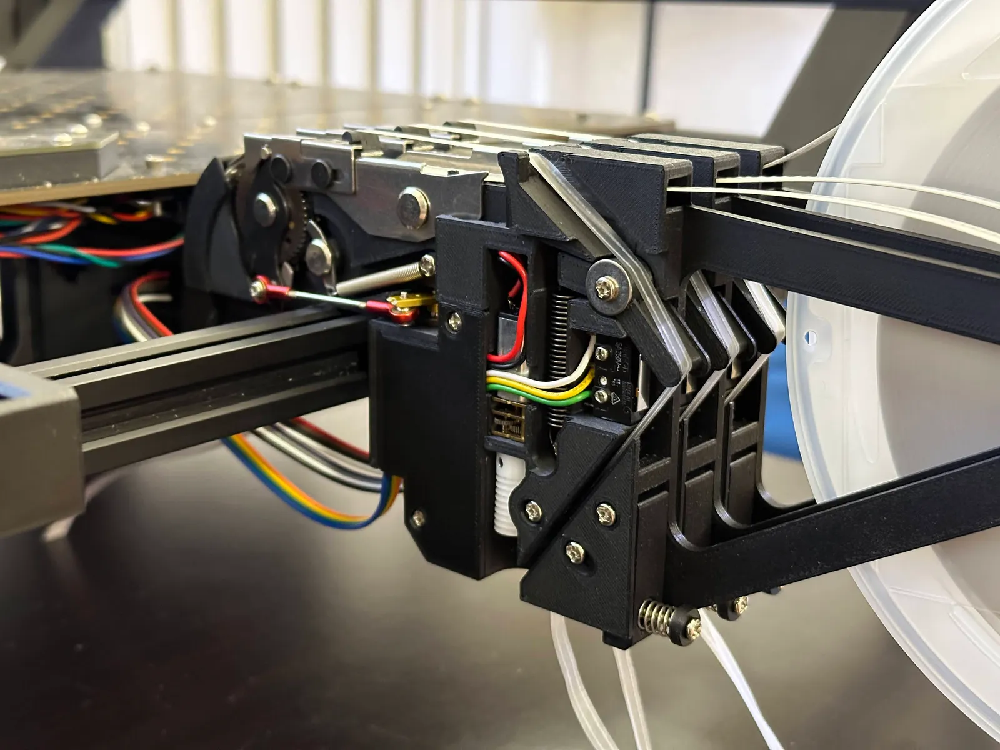

## Tray-Insert for Strip Feeder

**Made by**: Andre Fenske

**Compatible strip feeder**: 32mm, but can be adjusted

**Link to source**: [https://github.com/eRnEgIi/lumenpnp-mods/tree/main/Tray-Insert for Strip Feeder](https://github.com/eRnEgIi/lumenpnp-mods/tree/main/Tray-Insert%20for%20Strip%20Feeder)

**Description**: I made an insert for a regular 32mm strip feeder. In my case I needed a way to easily  handle small amounts of TSOP-56 IC’s (roughly 20mm x 14mm) which where provided to me in a big industrial tray. 

The current version is still far from perfect, but works relatively good if the strip feeder in OpenPNP is configured to use a tape width of 27 mm and a part pitch of 16 mm.

**Photos:**

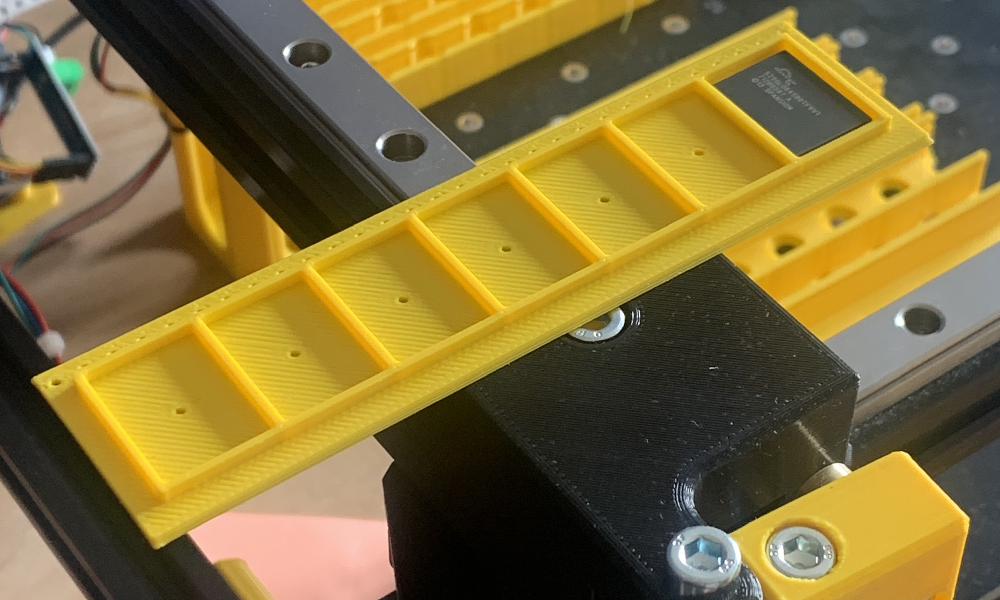

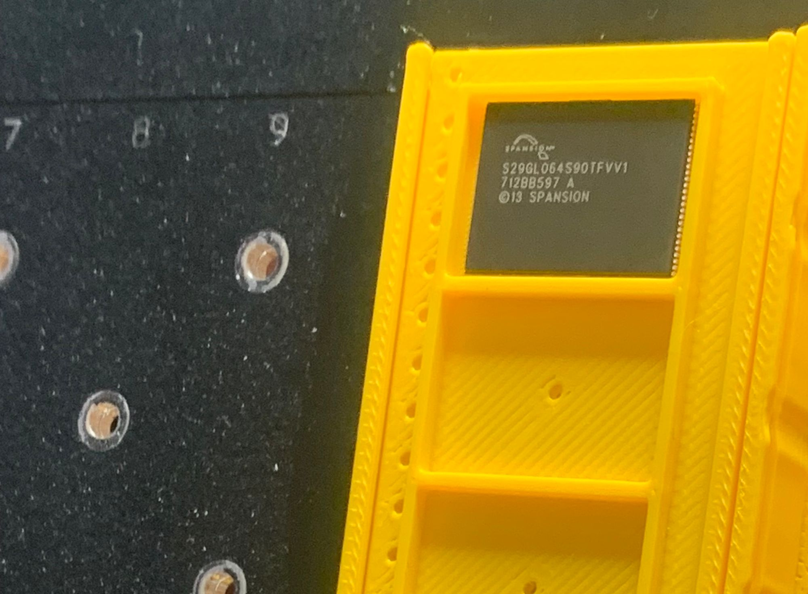

## **Menlu Strip Feeder 8mm/12mm with Flexible Tape Fastening**

**Made by**: Erik Lins

**Compatible machine version**: any with staging plates with 15/30mm hole pattern

**Link to source**: [https://www.printables.com/model/885928-menlu-strip-feeder-8mm12mm-for-lumenpnp](https://www.printables.com/model/885928-menlu-strip-feeder-8mm12mm-for-lumenpnp)

**Description**: These strip feeders have a flexible design which can cope with different tape thickness and supports the tape more tight over the full length. It’s mainly composed of two parts. An outer guide rail which clamps the tape on top (pretty much like the original feeders) plus an inner slider which is spring loaded and moves on two slightly tilted ramps resulting in an up movement when released and hence firmly pushing the tape to the top and decoupling the parts from touching the overhanging tape accidentally or working on adjacent feeders.

**Photos**:

[https://www.notion.so](https://www.notion.so)

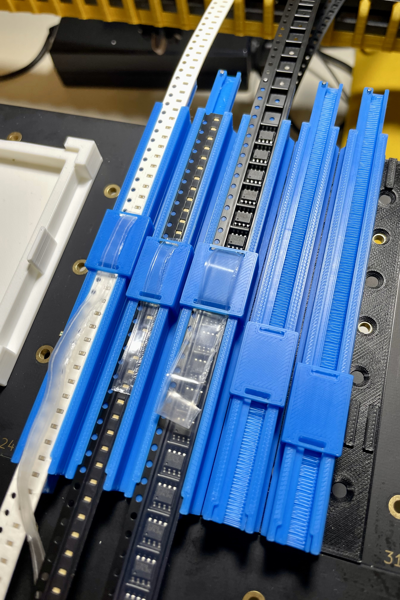

## Cut Tape Holder for LumenPNP with Feeder Harness

**Made by**: Erik Lins

**Compatible machine version**: any with 20x20mm extrusions

**Link to source**: [https://www.printables.com/model/966194-menlu-8mm12mm-cut-tape-holder-for-lumenpnp](https://www.printables.com/model/966194-menlu-8mm12mm-cut-tape-holder-for-lumenpnp)

**Description**: This is a 8/12mm cut tape holder for the LumenPnP pick and place machine and compatible with the feeder slot harness. Cover can be screwed to the side with printed M8 thread and a top side bracket allows for adding a paper label.

**Printing:** Prints with PLA, no supports needed. Cover should have 3-4 perimeters to make the thread more robust.

**Photos**: 

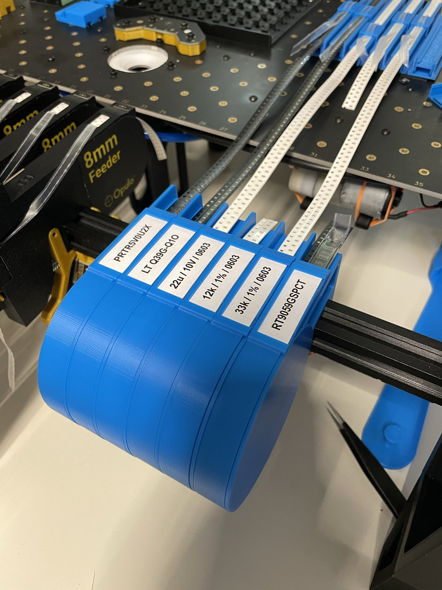