## Bottom camera tool changer

**Made by**: Curly Tale Games

**Link to source**: [https://www.printables.com/model/150059-lumenpnp-clip-pcb-holder-feeder-strips-and-nozzle-](https://www.printables.com/model/150059-lumenpnp-clip-pcb-holder-feeder-strips-and-nozzle-)

**Description**: I added some more holes to the tool changer so it can be placed near the bottom camera which frees up 25% of your build plate.

**Photos**: 


## Y-axis drag chain

**Made by**: qwertymodo

**Link to source**: [https://www.printables.com/model/171190-lumen-pnp-y-axis-drag-chain-mount](https://www.printables.com/model/171190-lumen-pnp-y-axis-drag-chain-mount)

**Description**: Mounting brackets to add a drag chain for the Y axis of the machine, as well as relocating the umbilical mount for the X axis.  Likely not compatible with the official kit wiring harness, but easy enough to add to DIY builds.

**Photos**: 

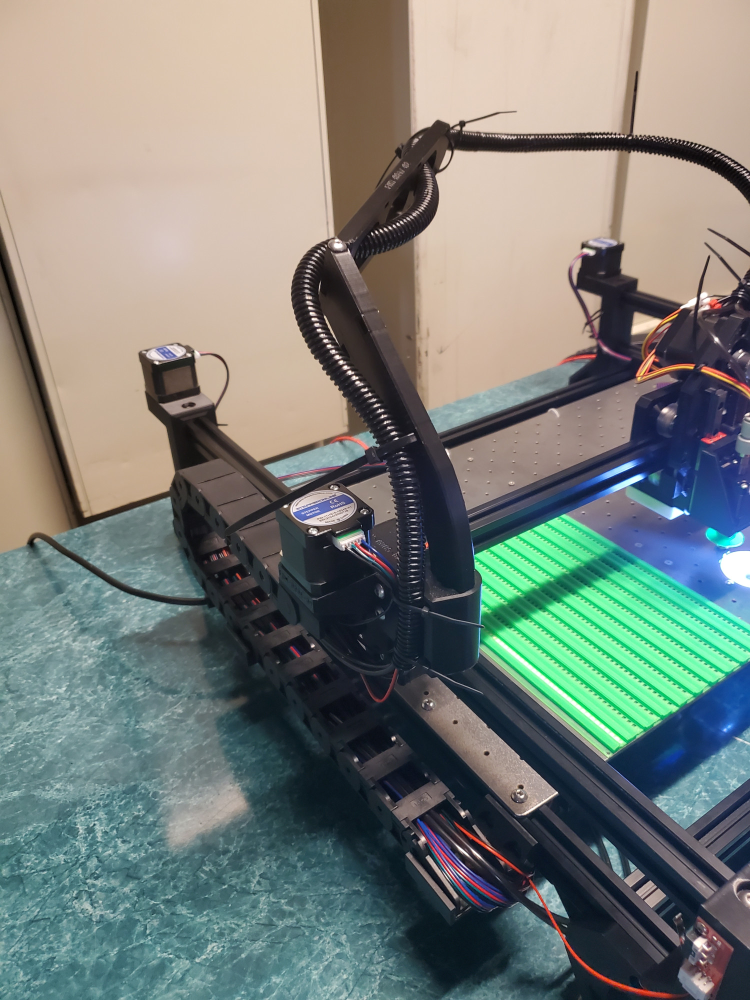

## LED strip ring light mounts

**Made by**: qwertymodo

**Link to source**: [https://www.printables.com/model/171276-lumen-pnp-strip-light-ring-mounts](https://www.printables.com/model/171276-lumen-pnp-strip-light-ring-mounts)

**Description**: On-axis mounts to use cheap WS2812B LED strip lights in place of the Lumen ring light PCBs.

**Photos**: 

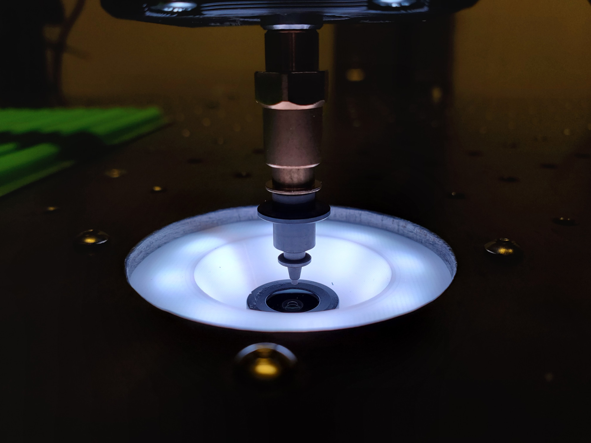

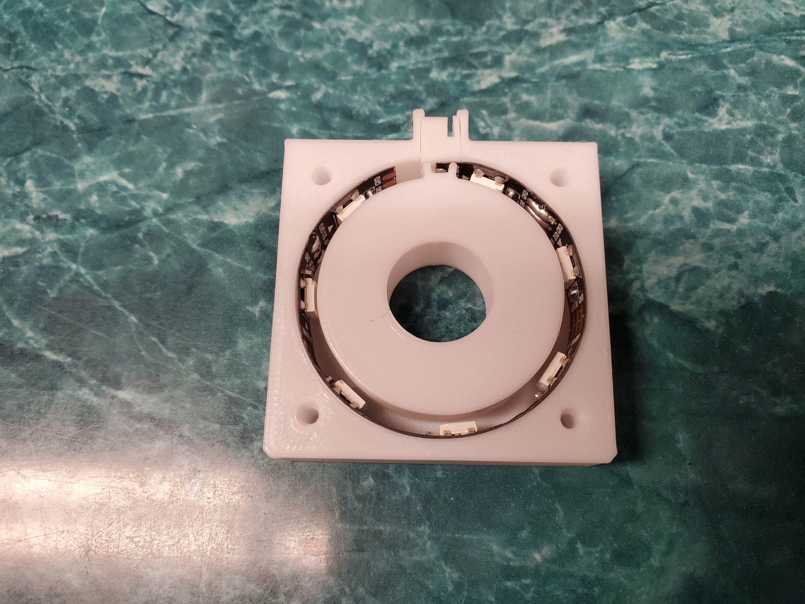

## Mean Well power supply mount

**Made by**: qwertymodo

**Link to source**: [https://www.printables.com/model/171271-lumen-pnp-mean-well-power-supply-mount](https://www.printables.com/model/171271-lumen-pnp-mean-well-power-supply-mount)

**Description**: Mounting bracket and switched mains inlet cover for a Mean Well LRS-350-24 power supply

**Photos**: 

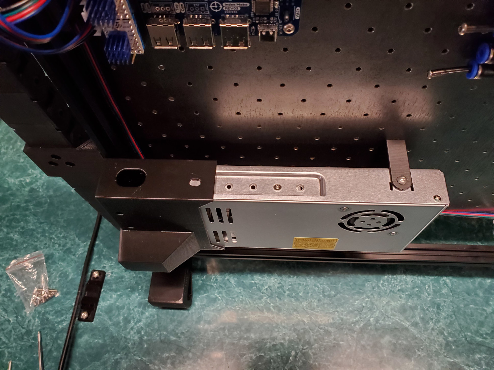

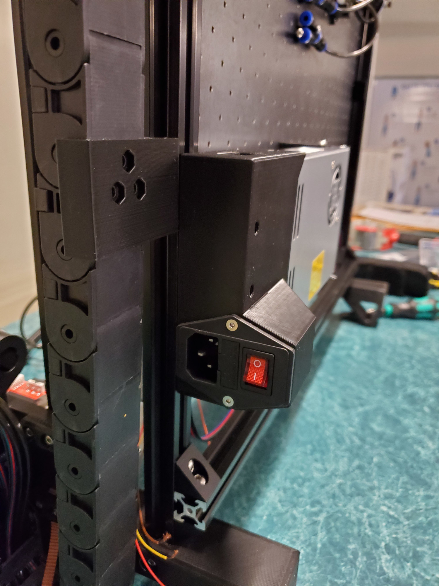

## 360mm Staging Plate “Long Body”

**Made by**: qwertymodo

**Link to source**: [https://www.printables.com/model/451094-lumen-pnp-360mm-staging-plate-feeder-rail-mod](https://www.printables.com/model/451094-lumen-pnp-360mm-staging-plate-feeder-rail-mod)

**Description**: Modified front legs that allow the use of both front and back feeder rails with a 360mm staging plate.  The rear feeder rail needs to be relocated by removing one of the angle brackets and sliding the rail all the way back against the rear legs.  The angle bracket can then be reattached on top of the feeder rail.

**Photos**: 

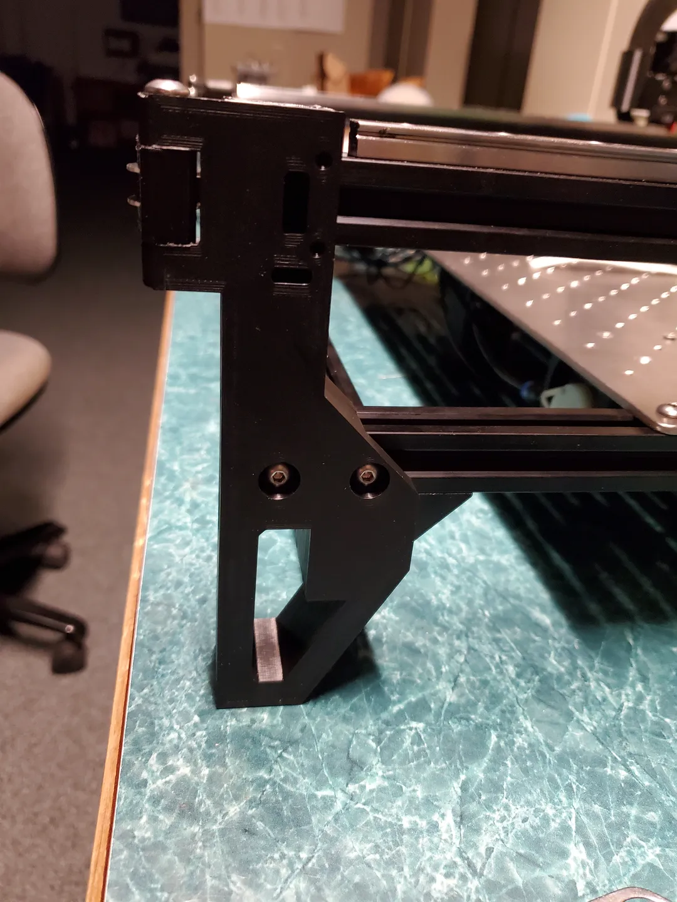

## 800mm X-axis mod “Wide-Body”

**Made by**: AlanaCat

**Link to source**: [https://grabcad.com/library/lumenpnp-wide-body-mod-1](https://grabcad.com/library/lumenpnp-wide-body-mod-1)

**Description**: This is a set of modified legs for the LumenPnP. Using the Wide Body legs, plus a longer belt and 800mm V-slot extrusion for the x axis, you will be able to access the entire width of the staging plate with both nozzles. Also requires a small change to Marlin’s `configuration.h` (which is shown below) to add 200mm to the x axis. Should work fine with the stock wiring but you might need to get slightly creative with the routing. Would also work great with the Y axis drag chain from qwertymodo posted above.

The print settings should be the same as for the stock legs.

```c
// @section machine

// The size of the printable area
#define X_BED_SIZE 635
#define Y_BED_SIZE 485
```

**Photos**: (Y Axis shortened for illustrative purposes only)

[Untitled](assets/img/mods/Untitled%2046fcf1a636db42dbbf64810cb1c8f8f7.csv)

## Lens adjust tool

**Made by**: Cor van Doorn

**Link to source**: [Lumen PNP Lens adjustment tool by Cor van Doorn | Download free STL model | Printables.com](https://www.printables.com/model/208453-lumen-pnp-lens-adjustment-tool)

**Description**: Have created a small tool to grab the camera lenses for adjustment. Printed in 100% infill transparent filament to have minimal blockade of the ring lights. Helped me a lot in getting the focus right

**Photos**:


Lens Adjust Tool

## Lens Adjustment tool for V3 machines (remix)

**Made by**: Jon Moyes

**Link to source**: [https://www.printables.com/model/333935-camera-focus-adjustment-tool-for-opulo-lumenpnp-v3](https://www.printables.com/model/333935-camera-focus-adjustment-tool-for-opulo-lumenpnp-v3)

**Description**: A set of tools for adjusting camera focus on the V3 machines - particularly helpful for the recessed bottom camera. The Top Camera tool can work with recessed Top Cameras when using the [4mm camera spacer](https://www.printables.com/model/339437-top-camera-spacer-for-lumenpnp-with-v3-linear-rail).

**Photos**:

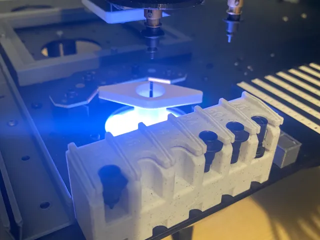

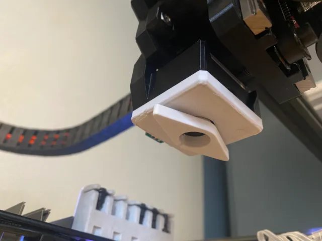

## Adjustable staging plate foot

**Made by**: jazzychad

**Link to source**: [https://www.printables.com/model/209164-lumenpnp-adjustable-staging-plate-foot](https://www.printables.com/model/209164-lumenpnp-adjustable-staging-plate-foot)

**Description**: A staging plate foot for LumenPnP with adjustable height with screw and jam nut. 

**Please note:** this was made as a prototype with the screw threads specifically made with my printer tolerances in mind, but it should work for most printers (I think). Just be aware that if you print this, it may not work perfectly. Tested using a Prusa MINI and Ultimaker3 using 0.2mm layer height and pretty standard settings.

**Photos**: 


## Alternative Power Connector Option

**Made by**: Stargirl Flowers

**Description**: Barely a mod, but instead of cutting up the included DC brick’s power cable and wiring directly into the motherboard, you can use a DC pigtail (like [this one](https://www.amazon.com/dp/B08PYT6HZ2?ref_=cm_sw_r_cp_ud_dp_9CEZ1AE0SP7QYN5PPSF4)). This lets you easily unplug the machine if you need to move it around. You can go one step further and get a little inline DC switch (like [this one](https://www.amazon.com/dp/B01FT4RBBM?ref_=cm_sw_r_cp_ud_dp_4NF4486S0511MDJFR88D)) and have a quick way to turn your machine on and off.

**Photos**: 


## Power Switch Mount

**Made by**: Jon Moyes

**Link to source**: [https://www.printables.com/model/302674-lumenpnp-power-switch-mount](https://www.printables.com/model/302674-lumenpnp-power-switch-mount)

**Description**: Adds a simple SPST power switch mounted to the left side of the machine.

**Photos**:

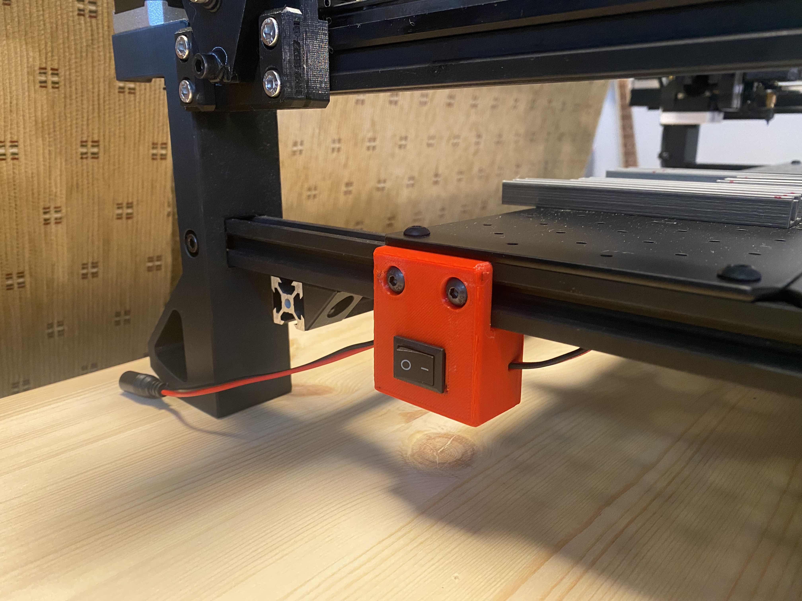

## PCB holder using aluminum angle

**Made by**: @infiniteneslives

**Files**:

[angle rail mounting clamp.stl](assets/img/mods/lumen_manual_conveyor_clamp.stl)

[angle pcb stopper.stl](assets/img/mods/Aluminum_angle_rail_clip.stl)

**Description**: This mod uses readily available and inexpensive [1/2” aluminum angle](https://www.homedepot.com/p/Everbilt-1-2-in-x-96-in-x-1-16-in-Thick-Aluminum-Angle-800047/204604756), weather stripping / foam tape, t-nuts, and small 3D printed clips to create a rail that holds PCBs in place.

1. Cut two lengths of aluminum angle to span the width of the machine (600mm each).
2. Use four mounting clamps and t-nuts to mount the angles onto the machine.
3. Cut and stick foam tape or weather stripping along the angles. Preferably use 5/16" (7.9mm) thick foam- this keeps the PCBs within the ideal focal plane (10mm above staging plate).
4. Place PCB stoppers along the angles as needed to hold PCBs in place.

**Photos**:

[Untitled](assets/img/mods/Untitled%2046bb02d9cb4b42e8ae1d200d7fd4e0ba.csv)

## Parametric staging plate OpenSCAD library

**Made by**: Stargirl Flowers

**Link to source**: [https://gist.github.com/theacodes/40d665b9e61ee4a3b86da20cb94df1d5](https://gist.github.com/theacodes/40d665b9e61ee4a3b86da20cb94df1d5)

**Description**: I re-created the staging plate design in OpenSCAD so now you can use it to create custom versions of the staging plate or use it as a reference for creating staging plate accessories. You can customize everything from the dimensions, to the grid holes, and even the camera hole.

**Photos**:

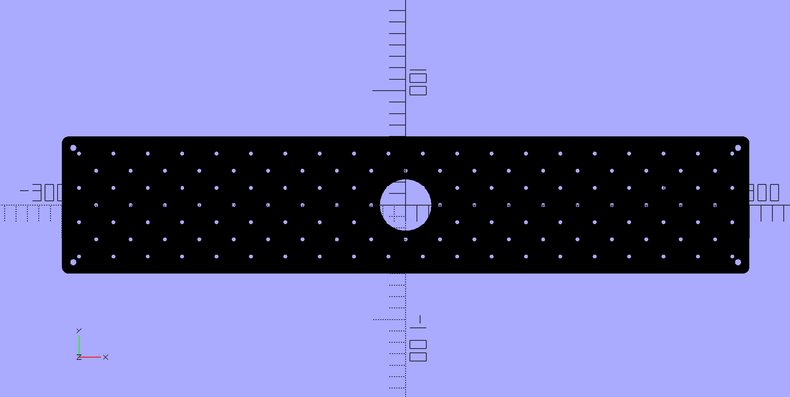

## Secondary fiducial calibration rig

**Made by:** Lixie Labs

**Link to source:** [https://www.printables.com/model/224290-lumenpnp-secondary-fiducial-rig](https://www.printables.com/model/224290-lumenpnp-secondary-fiducial-rig)

**Description:** This modified version of the Datum PCB mount allows for 3D calibration using a second fiducial mark!

You can find the necessary PDF for the second mark on the OpenPNP wiki here:

[https://github.com/openpnp/openpnp/files/5542424/FiducialHome.pdf](https://github.com/openpnp/openpnp/files/5542424/FiducialHome.pdf)

Just cut it out and push it in! If you're lucky, you cut it slightly too large and it will friction fit nicely, otherwise glue stick should work. (The second fiducial is 4mm higher than the primary.)

More info about 3D calibration:

[https://github.com/openpnp/openpnp/wiki/Vision-Solutions](https://github.com/openpnp/openpnp/wiki/Vision-Solutions)

**Photos:**

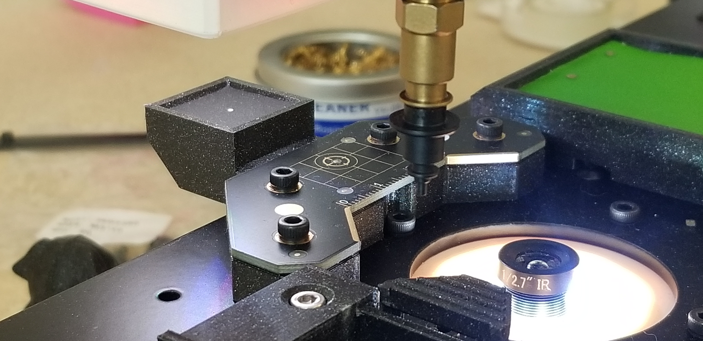

## X & Y axis linear rails

**Made by:** Stargirl

**Link to source:**

- V3: [https://www.printables.com/model/278803-lumenpnp-linear-rail-mods-v3](https://www.printables.com/model/278803-lumenpnp-linear-rail-mods-v3)
- V2: [https://www.printables.com/model/235331-lumen-pnp-linear-rail-mods](https://www.printables.com/model/235331-lumen-pnp-linear-rail-mods)
- [https://github.com/theacodes/3d-prints/tree/main/lumen](https://github.com/theacodes/3d-prints/tree/main/lumen/linear%20rail%20mod)

**Description**: Replaces the v-slot rollers on the X and Y axis with linear guide rails for [extra-smooth and fast movement](https://twitter.com/theavalkyrie/status/1543682188931129351). Preserves the original dimensions of the machine and work area and also preserves the original height of the head. Instructions over on the [Printables page](https://www.printables.com/model/235331-lumen-pnp-linear-rail-mods), and there’s a [separate version for V3](https://www.printables.com/model/278803-lumenpnp-linear-rail-mods-v3).

**Photos:**


## X & Y Drag Chain mod

**Made by**: Chris Howell (OpenEVSE)

**Link to source**: [https://github.com/chris1howell/X_Y_DragChain_LumenPnP](https://github.com/chris1howell/X_Y_DragChain_LumenPnP)

**Description**: Drag chains in a more standard configuration for X and Y axis, provide reduced rotational torque on the Z access and smoother overall operation. Bolts on the X and Y axcess without any modification.

This mod works very well with Stargirl’s X and Y linear rails or the stock Lumen PnP 3.x rollers.

Note, this mod requires a stiff cable chain that does not sag or it may contact objects on the build plate. A Semi Enclosed drag chain is reccomended. [https://www.amazon.com/dp/B07QZR6GMT](https://www.amazon.com/dp/B07QZR6GMT)

**Photos**:

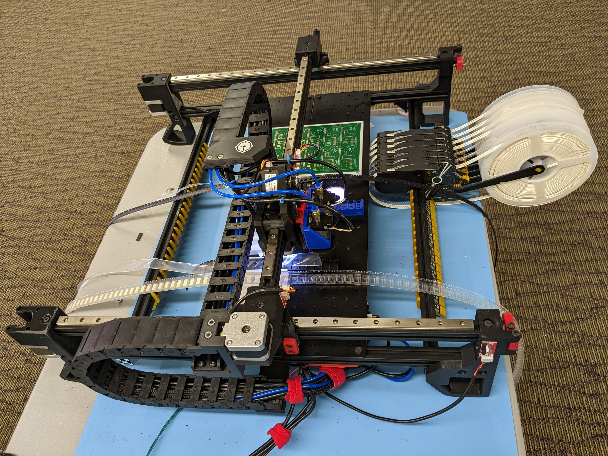

## **x-gantry backplate for linear rail mod with umbilical arm**

**Made by:** vbretsch

**Link to source:** 

[https://www.printables.com/de/model/247644-lumen-x-gantry-backplate-for-linear-rail-mod-with-](https://www.printables.com/de/model/247644-lumen-x-gantry-backplate-for-linear-rail-mod-with-)

**Description:** This is a drop in x-gantry backplate replacement for Stargirls linear rail mod to be able to attach the umbilical as in the original Opulo lumen pnp design with v-rollers.

**Photo:**

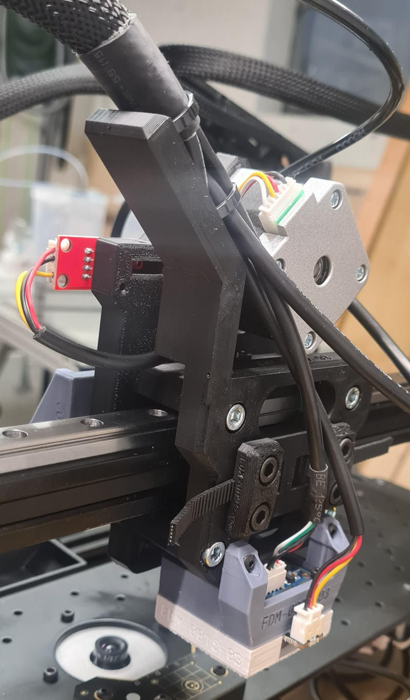

## Top Camera Spacer for Stargirl’s V3 Linear Rail Mod

**Made by**: Jon Moyes

**Link to source**: [https://www.printables.com/model/339437-top-camera-spacer-for-lumenpnp-with-v3-linear-rail](https://www.printables.com/model/339437-top-camera-spacer-for-lumenpnp-with-v3-linear-rail)

**Description**: After installing Stargirl's awesome [v3 linear rail upgrade](https://www.printables.com/model/278803-lumenpnp-linear-rail-mods-v3) and converting other parts of my machine to use the updated V3 LumenPnP parts, I found that the top camera lens was VERY close, if not touching, the nozzle rack. The nozzle rack was updated between v2 and v3, making it taller to match with the raised Z Gantries which enable support for taller components.

This spacer raises the camera 4mm, which leaves the lens flush with the Top Light, eliminating any chance of crashing your camera lens into *anything* on the machine.

**Photos**:

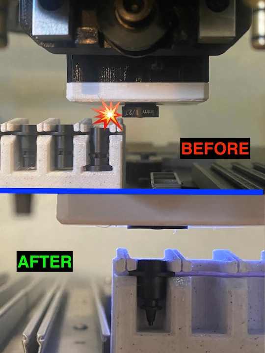

## Parametric PCB holder

**Made by**: Stargirl

**Link to source**:

- [https://www.printables.com/model/235905-lumen-pnp-parametric-pcb-holder](https://www.printables.com/model/235905-lumen-pnp-parametric-pcb-holder)
- [https://github.com/theacodes/3d-prints/blob/main/lumen/pcb_holder.scad](https://github.com/theacodes/3d-prints/blob/main/lumen/pcb_holder.scad)

**Description**: A parametric PCB holder designed in OpenSCAD to fit snugly into the Lumen PNP staging plate. This allows you to put in your PCB dimensions and generate a holder that will perfectly fit your PCB and hold it at the ideal height.

**Photos**:


## Nozzle Rack 75 Mod

**Made by**: Andre Sandkühler

**Link to source**: [https://github.com/opulo-inc/mods/blob/23abe657d6661864b852c8d8c31f6a3a1895332c/pnp/cad/FDM/nozzle-rack.FCStd](https://github.com/opulo-inc/mods/blob/23abe657d6661864b852c8d8c31f6a3a1895332c/pnp/cad/FDM/nozzle-rack.FCStd)

[Nozzle Rack 75 Mod.zip](assets/img/mods/Nozzle_Rack_75_Mod.zip)

**Description**: I made a mod to the Nozzle Rack FreeCAD file. The original file can be found in the link above. The bigger variant of the 75 nozzle now has enough space to fit inside.

**Photos**:


## Mobo Cover for the v3 motherboard

**Made by**: vbretsch

**Link to source:** [https://www.printables.com/de/model/298667-motherboard-cover-bottom-and-top-for-lumen-pnp-mob](https://www.printables.com/de/model/298667-motherboard-cover-bottom-and-top-for-lumen-pnp-mob)

**Description:** This is a cover for the lumen PNP's v3 motherboard, which does fit the reset and boot buttons on the motherboard.

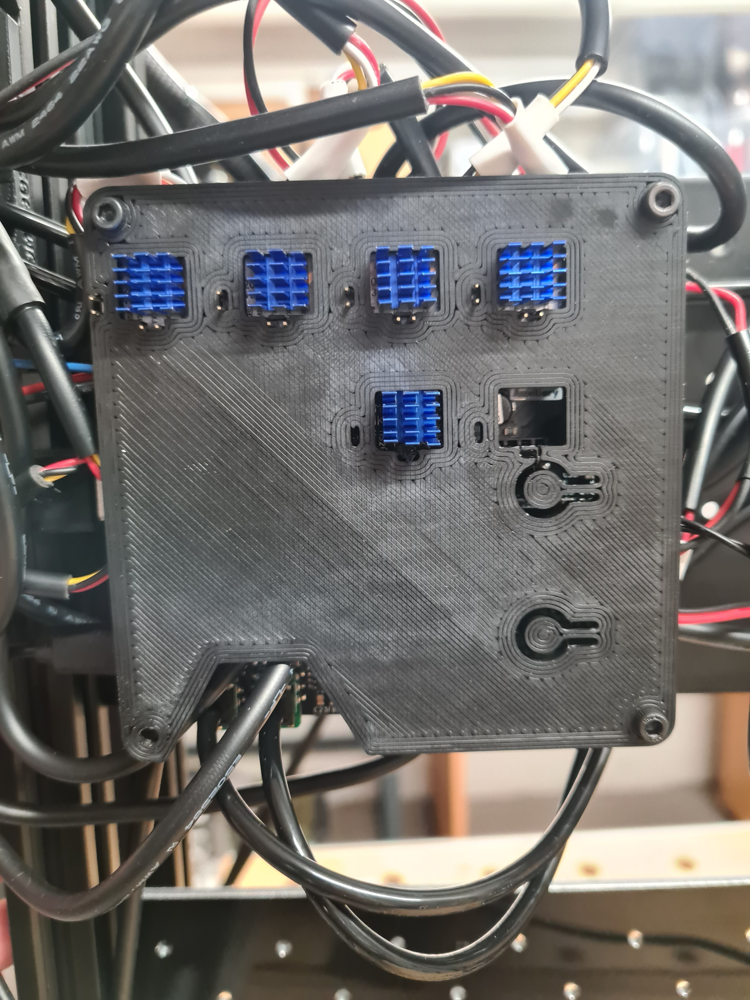

## Nema8 Z-Gantry Mod for LumenPNP

**Made by**: rdu

**Link to source**: [https://github.com/rdu/lumen-z-gantry-nema8](https://github.com/rdu/lumen-z-gantry-nema8)

**Description**: This mod for the LumenPNP replaces the original Z-Gantry with one compatible with a Nema8 stepper motor. The project includes a FreeCAD file that describes the modified Z-Gantry. Instructions on how to replace the original Z-Gantry in your LumenPNP machine with this one can be found in the README file in the repository.


## Dual x-axis linear rails for LumenPnP v3

**Made by:** dna-topoisomerase

**Link to source:** [https://www.printables.com/model/422397-dual-x-axis-linear-rails-for-lumenpnp-v3](https://www.printables.com/model/422397-dual-x-axis-linear-rails-for-lumenpnp-v3)

**Description:** This mod builds on Stargirl’s v3 linear rail mod to add a second linear rail on the x-axis, increasing the rigidity of the toolhead. Intended to be used with LumenPnP v3.0 x-gantry parts.

**Photos:**

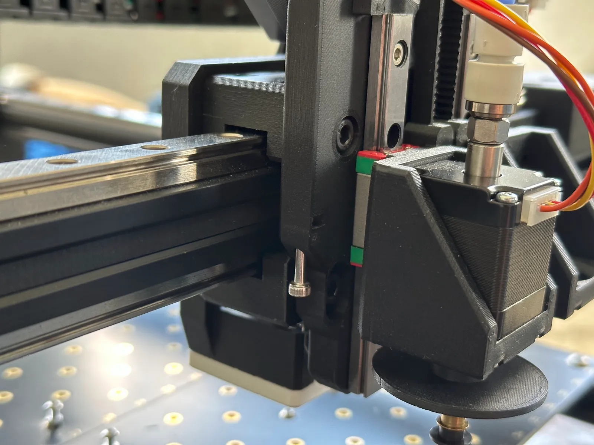

## Dual Vacuum Pump Mount

**Made by**: Curly Tale Games

**Compatible machine version**: v3 or v2

**Link to source**: [https://www.printables.com/model/661779-dual-vacuum-pump-mount-for-lumen-pnp](https://www.printables.com/model/661779-dual-vacuum-pump-mount-for-lumen-pnp)

**Description**: This vacuum pump mount allows you to replace the rubber bands holding the vacuum pumps without removing the mounts from the staging plate.

This model has modeled in supports that can be easily cut or snapped off after printing.

**Photos**:

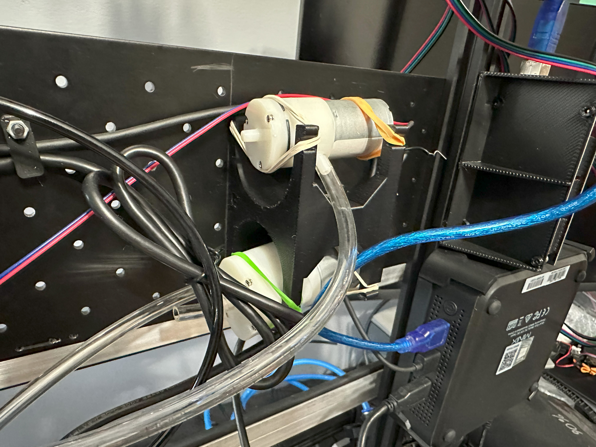

## Resin Printed CP40-capable Nozzles

**Made by**: Andrew Ortman

**Compatible machine version**: v3 or v2

**Link to source**: [https://www.printables.com/model/795539-custom-cp40-capable-smt-nozzles-for-lumen-pnp](https://www.printables.com/model/795539-custom-cp40-capable-smt-nozzles-for-lumen-pnp)

**Description**: Having trouble with the black nozzles and your vision pipelines? These custom nozzles can be printed in any color (green recommended) and used along with OpenPNP’s MaskHSV op for some chroma-key goodness. These models can be printed using an off the shelf 3d printer and cheap ABS-like resin. Be sure to read the printable directions on how to get a perfect result for the small bore sizes!

Also included: a 6-slot custom nozzle holder designed specifically for these nozzles and the LumenPNP!

**Photos**:

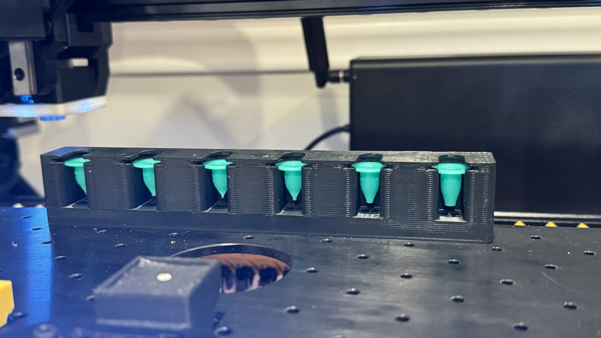

## Menlu Flexible PCB Board/Panel Mount

**Made by**: Erik Lins

**Compatible machine version**: any with staging plates with 15/30mm hole pattern

**Link to source**: [https://www.printables.com/model/897588-menlu-flexible-pcb-boardpanel-mount-for-lumenpnp](https://www.printables.com/model/897588-menlu-flexible-pcb-boardpanel-mount-for-lumenpnp)

**Description**: This is a flexible mounting system for pcbs/panels onto the LumenPnP pick&place machine. It's composed of a base mounting plate with fixed brackets for one pcb corner plus movable support sliders for the remaining pcb edges.

A grid arrangement of dovetails on the mounting plate allows to insert the sliders and align them to support different pcb sizes.

**Photos**:Feeder Adaptations

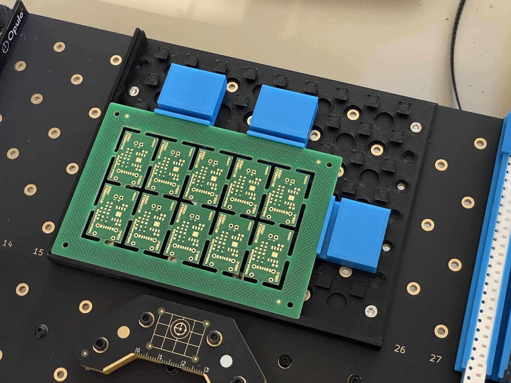

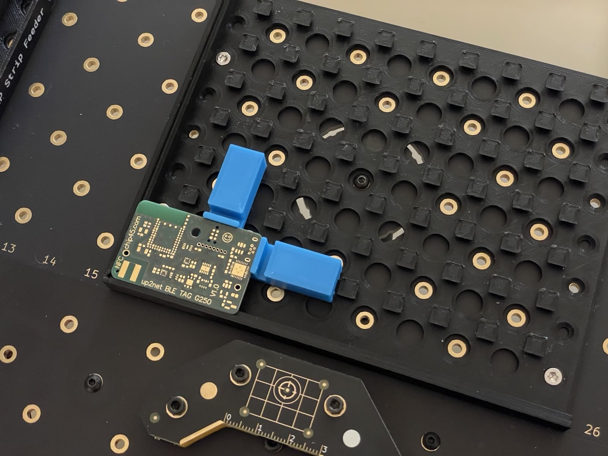

## Staging Plate M3 Nut Holder

**Made by:** Sean Smith

**Link to source:** [https://www.printables.com/model/1032304-staging-plate-nut-holders-for-lumen-pnp](https://www.printables.com/model/1032304-staging-plate-nut-holders-for-lumen-pnp)

**Description:** 3D printed M3 nut holder to make it easier to mount things on the top of the staging plate without have to try and get your hand under the machine to hold the nut.

**Photos:**

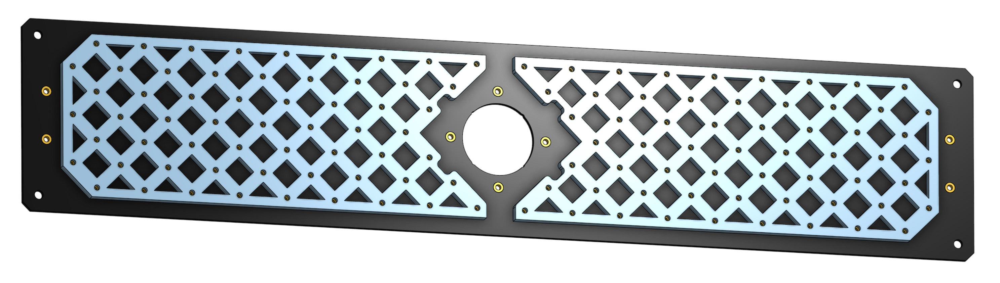
 
## 550mm Linear Rail X- Axis

**Made by**:  Curly Tale Games

**Compatible machine version**: v4

**Link to source**: [https://www.printables.com/model/1047343-lumen-pnp-550mm-linear-rail-x-axis-mod-v4](https://www.printables.com/model/1047343-lumen-pnp-550mm-linear-rail-x-axis-mod-v4)

**Description**: This allows you to use a 550mm linear rail which is easier to source than the stock 525mm rail.

**Photos**:

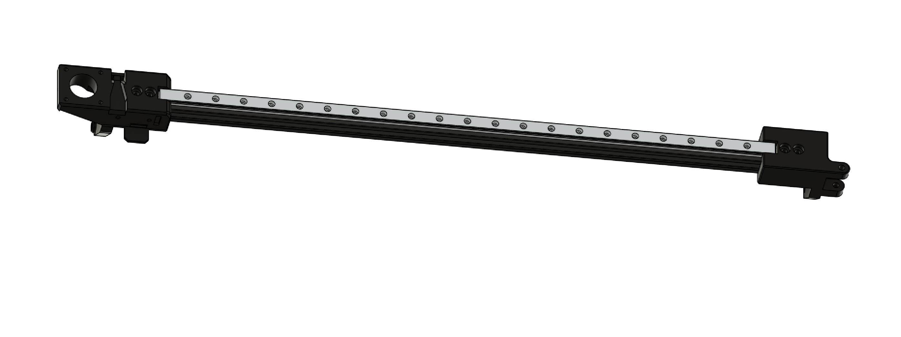
